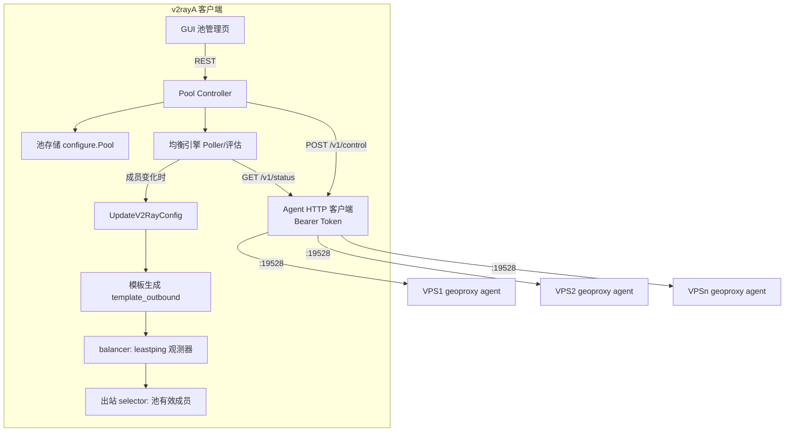

# v2rayA 节点池均衡 + VPS 流量控制 设计

日期：2026-08-25
状态：已获用户确认（第 1~3 节）

## 背景与目标

v2rayA 是 [geoproxy-server](https://github.com/vistone/geoproxy-server)（VPS 端 sing-box 一键部署脚本）的客户端。用户拥有多台 VPS，每台运行 geoproxy-server（TUIC 等协议 + KiwiVM 流量熔断 + WireGuard Mesh）。本设计在 v2rayA 客户端内新增：

1. **节点池自动均衡（客户端决策）**：把多台 VPS 组成显式"池"，按各 VPS 上报的实时状态自动分配连接。
2. **客户端 ↔ VPS 相互沟通**：在 geoproxy-server 侧新增"上报 Agent"（`:19528`，Token 鉴权），v2rayA 统一轮询；本仓库只实现客户端侧 + 契约文档，Agent 由 geoproxy-server 仓库按契约实现。
3. **客户端掌握 VPS 流量控制**：展示流量用量/配额/熔断状态；远程触发熔断/恢复、修改阈值；**流量余量作为均衡的硬性输入**（客户端兜底，不依赖服务器端 KiwiVM 停服）。

## 已确认的决策

| # | 决策 |
|---|---|
| 1 | 均衡形态：**客户端侧节点池均衡**。服务器只上报数据，客户端做决策 |
| 2 | 沟通通道：**geoproxy-server 新增上报 Agent**（`:19528`，Bearer Token），与 mesh 控制面（`:19527`）解耦 |
| 3 | 流量控制深度：**展示 + 远程控制 + 客户端兜底**（流量余量参与均衡决策） |
| 4 | 均衡机制：**动态成员制**。流量余量是硬门槛（低于阈值从 balancer selector 摘除、恢复加回）；延迟/负载/连接数交给 xray leastping 实时选优；配置只在成员变化时重新生成 |
| 5 | 落地范围：**只做客户端侧**（本仓库）+ Agent 契约文档；Agent 不可达时优雅降级（fail-open） |
| 6 | 池形态：**新增显式"池"实体**：名称 + 成员（引用 `configure.Which`）+ 池级 Agent 配置 + 均衡参数，独立 REST 控制器 + GUI 页面 |

## 架构



核心循环：均衡引擎按池轮询各 VPS agent → 更新每成员状态（流量余量/负载/可达性）→ 硬门槛判定（摘除/加回）→ 成员集合变化时调用 `UpdateV2RayConfig()` 重新生成 balancer selector → 连接级选优由 xray leastping 实时完成。

## Agent API 契约（geoproxy-server 侧实现，客户端按此对接）

### `GET /v1/status`（`Authorization: Bearer <token>`）

```json
{
  "node": { "id": "tile1.spacexway.com", "protocol": "tuic", "version": "0.2.40" },
  "system": { "load1": 0.35, "cpuPct": 5.2, "memUsedPct": 42.1, "activeConnections": 23 },
  "latency": { "target": "https://www.gstatic.com/generate_204", "ms": 18 },
  "traffic": {
    "usedBytes": 123456789,
    "quotaBytes": 1099511627776,
    "usedPct": 11.2,
    "warnPct": 80,
    "stopPct": 95,
    "nextReset": "2026-09-01T00:00:00Z",
    "tripped": false,
    "trippedAt": null,
    "checkSec": 300
  },
  "mesh": { "role": "master", "peerCount": 4 },
  "reportedAt": "2026-08-25T10:00:00Z"
}
```

### `POST /v1/control`（同 Token）

```json
{ "action": "trip" }
{ "action": "resume" }
{ "action": "set-thresholds", "warnPct": 80, "stopPct": 95 }
{ "action": "set-check-interval", "seconds": 300 }
```

### 契约要点

- `traffic` 字段直接映射 KiwiVM 熔断逻辑（`data_counter / (plan_monthly_data × monthly_data_multiplier)`），`tripped` 对应 `TRAFFIC_TRIPPED=1`
- `activeConnections` 由 agent 从 sing-box 运行时 API 采集（客户端展示；后续版本可参与加权）
- 所有响应带 `reportedAt`，客户端据此判断数据新鲜度
- agent 不可达/超时 → 客户端标记成员 `unreachable`，**不参与硬门槛**（fail-open，避免误摘）；core 的 leastping 探测仍正常选中

## 数据模型（`service/db/configure/pool.go`）

```go
type Pool struct {
    Name     string        `json:"name"`     // 池名，同时作为 balancer outbound 名
    Outbound string        `json:"outbound"` // 生成的出站名（balancer tag），默认取池名
    Members  []PoolMember  `json:"members"`
    Settings PoolSettings  `json:"settings"`
}

type PoolMember struct {
    Which     configure.Which // 复用现有引用：支持 ServerType 与 SubscriptionServerType
    AgentURL  string          // http(s)://<host>:19528
    AgentToken string         // 随池配置明文存储（与现有节点链接同级）
    Enabled   bool            // 手动启停该成员
}

type PoolSettings struct {
    PollInterval    string  // 轮询间隔，默认 30s
    TrafficGatePct  float64 // 硬门槛：usedPct ≥ 此值 → 摘除；默认 90（先于服务器 95% 停服）
    HysteresisPct   float64 // 回加滞后：usedPct < gate - 5 → 加回；默认 5
    ProbeURL        string  // 观测器探测地址，默认沿用 gstatic generate_204
    FailOpen        bool    // 全部成员被门槛摘除时是否放回最优成员；默认 true
}
```

- 存储：新增 `GetPools()/SetPools()/AddPool()/RemovePool()`，跟随现有 `db/configure` 的 plain/set 操作模式；`db/migrate.go` 加池存储迁移
- 成员引用复用 `configure.Which` → 池可混搭"手动添加的服务器"和"订阅里的服务器"，无需新节点类型

## 均衡引擎（新包 `service/pkg/pool`）

**组件**：

1. **Poller**（每池一个 goroutine + ticker）：并发 `GET /v1/status` 各成员 → 写回成员状态缓存（`MemberState`：`reportedAt`、`traffic`、`system`、`latency`、`reachable`）
2. **Gate 评估器**：每次轮询后对每成员判定：
   - agent 不可达 → 保持现状（fail-open），标记 stale
   - `usedPct ≥ TrafficGatePct` → 从 selector 摘除（若不在已摘除列表）
   - `usedPct < TrafficGatePct - HysteresisPct` → 加回（若当前被摘除）
   - 其它情况不动作
3. **成员管理**：摘除/加回只改变"有效成员集合"，**不触碰** `configure.Whiches`（用户手动 touch 的节点不受影响）
4. **配置联动**：有效成员集合变化时调用 `UpdateV2RayConfig()` 重新生成模板；balancer selector 只含有效成员
5. **兜底**：若全部成员被摘除且 `FailOpen=true` → 放回 usedPct 最低的成员并记录告警日志（避免断网）

**与现有配置生成机制的集成（关键机制）**：

池成员**不写入** `configure.Whiches`，而是由引擎维护一个**有效成员注册表**（`service/pkg/pool` 包内状态）。

- `NewTemplateFromConnectedServers` 调用的 `getConnectedServerObjs()`（`service/kernel/v2ray/process.go` L317）在构造完 touch 节点的 `serverInfos` 后，**追加**池有效成员的 `serverInfo{Info, OutboundName: pool.Outbound, PluginPort: 0}`（成员通过 `configure.Which.LocateServerRaw()` 解析）
- 引擎在池创建/编辑时执行 `configure.SetOutboundSetting(pool.Outbound, {ProbeURL, ProbeInterval: PollInterval, Type: leastping})`，balancer 的 observatory（`template_api.go` SetAPI 按 outbound 组构建 MultiObservatory）自动生效
- balancer 生成（`resolveOutbounds`：同一 OutboundName 有 ≥2 个 ServerObj 时建 balancer）、selector、UDP 判定**全部复用现有逻辑，零改动**
- 去重规则：若某链接同时出现在 touch 列表和池中，二者各自生成独立出站（不同 tag 指向同一服务器），功能正确；GUI 在编辑时提示避免重复，不做硬性禁止
- 兜底：池成员全部被摘除且 `FailOpen=true` 时，引擎放回 usedPct 最低的成员并告警（避免断网）

**均衡决策分工**：

- 客户端（本引擎）：流量硬门槛 + 成员进出池（低频，分钟级）
- core（xray leastping）：连接级实时选优（高频，每次连接/探测）
- 成员进池后，leastping 探测延迟决定当前出站，无需重启即可切换

## REST API（新增 `service/server/controller/pool.go`，接入现有 router）

| 方法 | 路径 | 说明 |
|---|---|---|
| GET | `/api/pools` | 池列表 + 每成员实时状态（agent 可达性、流量、门槛状态） |
| POST | `/api/pools` | 创建池（校验：名称唯一、成员非空、agent 地址格式） |
| PUT | `/api/pools/:name` | 更新池（成员/参数/凭证） |
| DELETE | `/api/pools/:name` | 删除池（从 balancer 移除，更新配置） |
| POST | `/api/pools/:name/control` | 远程控制：`{member: which, action: trip\|resume\|set-thresholds\|set-check-interval}` → 代理到对应 agent |
| GET | `/api/pools/:name/status` | 单池聚合状态（前端轮询用，轻量） |

所有写操作走现有 `updatingMu` 互斥，避免与 touch/订阅更新并发冲突。

## GUI（接入现有 Vue 路由 + store）

- **页面"节点池"**：池卡片列表 → 每卡片显示成员健康状态（流量用量条、agent 可达性、门槛状态、上次上报时间）
- **新建/编辑弹窗**：池名 + 成员多选（复用现有服务器/订阅选择器）+ 每成员 Agent 地址/Token + 均衡参数（门槛%、轮询间隔、fail-open 开关）
- **流量控制操作**：每成员行内 `熔断` / `恢复` / `改阈值` 按钮，结果 toast 反馈
- **实时刷新**：前端 10s 轮询 `/api/pools/:name/status`

## 降级与错误处理

| 场景 | 行为 |
|---|---|
| agent 不可达（超时/拒连） | 成员标记 `unreachable`，不参与硬门槛；leastping 仍可选中（fail-open） |
| Token 无效 / 鉴权失败 | 标记 `authError`，UI 提示，不摘除 |
| 控制请求失败 | 返回具体错误（与服务器侧 `geoproxy-server traffic` 同源信息），不改变本地状态 |
| 池成员全被摘除 | fail-open 放回最优成员 + 告警日志 |
| 上游数据过期（`reportedAt` 超时） | 该成员视为不可达处理 |

## 测试策略

- **单元测试**（Go）：Gate 判定纯函数（门槛/滞后/恢复/全摘兜底）、轮询状态合并、配置校验
- **集成测试**：`httptest` 起 mock agent（返回契约 JSON）→ 验证引擎摘除/加回触发 `UpdateV2RayConfig` 的正确次数（只应在成员集合变化时触发）
- **契约测试**：mock agent 按契约字段返回，验证客户端解析容错（字段缺失/异常值不 panic）
- GUI 手动验证路径：创建池 → 上报低用量 → 观察 balancer selector 含全部成员 → mock 高用量 → 观察成员被摘除

## 交付物清单（客户端仓库内）

1. `service/db/configure/pool.go` — 池数据模型 + 存储
2. `service/pkg/pool/` — 均衡引擎（poller/gate/成员管理）
3. `service/server/controller/pool.go` + router 注册
4. `service/kernel/v2ray` 改动 — balancer selector 只含有效成员
5. `gui/src/` — 池管理页面 + store + 路由
6. `docs/geoproxy-agent-api.md` — Agent 契约文档（给 geoproxy-server 仓库实现用）
7. 测试 + 迁移（`db/migrate.go` 加池存储）

## 非目标（本版本不做）

- geoproxy-server 侧 Agent 实现（另一个仓库，按契约文档实现）
- 基于负载/连接数的加权均衡（`activeConnections` 本版仅展示）
- 池的自动发现（手工配置 Agent 地址/Token）
- Master 高可用 / Mesh 相关改动
